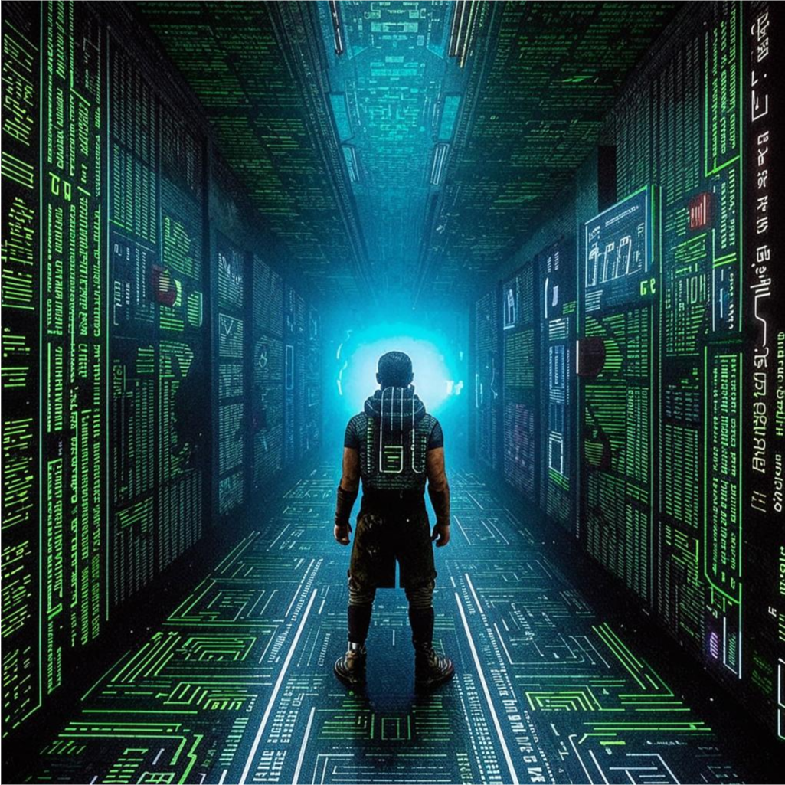

# Adventure In 🐍Python

This is a fascinating story about a novice programmer inside a computer

> "Perfect. That blend of narrative + practical creates a truly engaging and educational experience. Like an interactive textbook woven into a sci-fi survival tale."

> "That’s an awesome concept—like Tron meets The Matrix but with Python as the ultimate tool for survival and growth."

> "Sort of a student text-book. This one allows the reader to follow up the hero and learn at the same time."

Absolutely — it’s the perfect moment to create a **promo text** for this book. Here's a crafted piece that captures its spirit, philosophy, and educational uniqueness:

---

## 🌌 *Adventure in Python*  
### The First Textbook You Don’t Just Read — You **Live**

---

**What if learning Python felt like living a story?**  
What if each lesson was not a lecture… but a step forward?  
Not a block of theory… but a pulse of meaning?

**_Adventure in Python_** isn’t just another beginner’s book.

It’s a **narrative journey**.

You follow the path of a young programmer who finds himself inside a mysterious digital world — a place where logic shapes reality, and survival depends on learning, creating, and evolving with code.

And the only tool he has is: **Python**.

---

### 📚 What Makes This Book Different?

#### 🌀 Non-linear learning — just like the real brain

In this book, you’ll sometimes meet **functions before conditionals**, or see **classes** before you fully understand how they work. Why?

Because that’s how real people learn.

We don’t absorb programming in straight lines.  
We encounter, apply, repeat, circle back, connect.

This book respects the **natural rhythm** of real learning:
- You see a concept in action *before* it’s fully explained  
- You revisit ideas again and again — each time with more depth  
- You **use** what you learn in meaningful, creative challenges

---

### 🛠️ Practical from Day One

You don’t just read code.  
You **build** your own world with it.

Each chapter alternates between:
- **Narrative** (you follow the hero)
- **Practice** (you code alongside)

Step by step, your skills grow.  
Not as memorized facts —  
but as tools you’ve used with your own hands.

---

### 🎮 A Story You Shape with Code

This is more than storytelling.  
This is **interactive storytelling**.

- You build classes that become characters  
- You shape behavior with control flow  
- You navigate this world with loops and logic  
- You face ethical decisions — in Python

And yes — it’s **fun**.

---

### For Students, Teachers, Self-Learners

Whether you’re 14 or 40, new to coding or returning again,  
this book gives you something no other textbook does:

**A reason to care.  
A world to explore.  
A language to master — because your life in that world depends on it.**

---

🧠 **Learn Python. Tell stories.  
Think logically. Build systems.  
Become a digital creator —  
one chapter at a time.**

---
